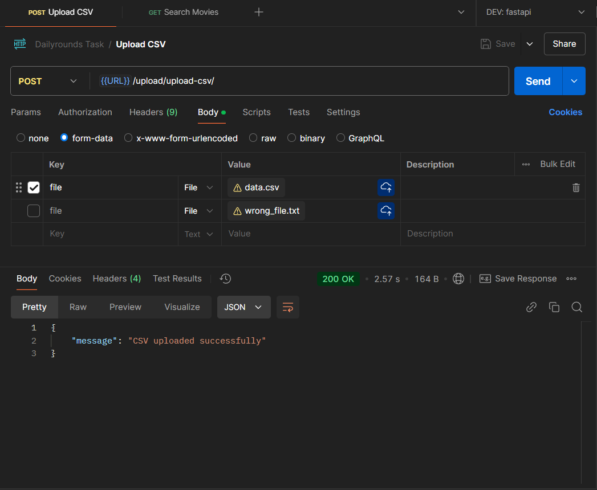
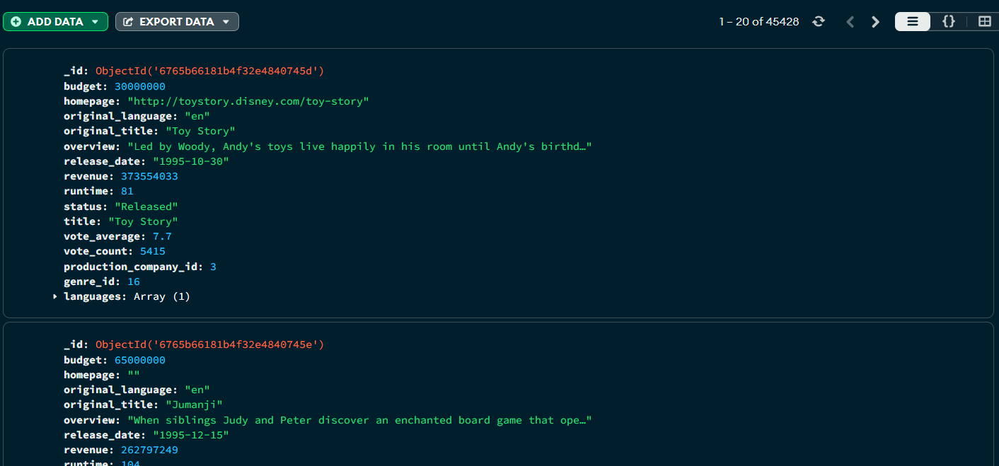
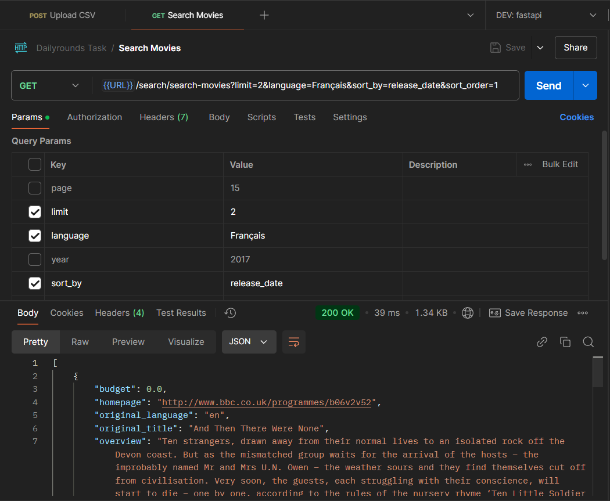

# Dailyrounds Task

This project is developed using FastAPI + MongoDB and designed to upload CSV files with movie data and search for the uploaded data as according to the requirements.

## Getting Started

### Prerequisites

Ensure you have the following installed on your system:

- Docker
- Docker Compose

### Running the Project

1. **Clone the Repository**

   Clone this repository to your local machine using:

   ```bash
   git clone https://github.com/iblameRishi/dailyrounds-task.git
   
   cd dailyrounds-task
   ```


2. **Build and Run with Docker Compose**

   Use Docker Compose to build and run the application:

   ```bash
   docker-compose up
   ```

   This command will build the Docker images and start the services defined in the `docker-compose.yml` file.
   &nbsp;

3. **Access the API**

   Once the services are up and running, you can access the API at `http://localhost:8000`.

   You can also view the API documentation at `http://localhost:8000/docs`.

## Project Structure

- **app/main.py**: Main file for the FastAPI application. It initializes the database and includes routers for user and admin endpoints.
&nbsp;

- **app/database/**: Contains database connection logic and Pydantic schemas for data validation.
  - `mongo_database.py`: Manages MongoDB connection and initialization.
&nbsp;

- **app/routes/**: Contains the API routes for users and admins.
  - `search.py`: Handles searching for the movie data.
  - `uploads.py`: Handles CSV file uploads.
&nbsp;

- **app/utils/CSV_handling**: Util function to handle parsing of the uploaded CSV file and storing in the database.
&nbsp;

- **app/schemas.py**: Has schema for responses.

## API Endpoints

### CSV Upload Endpoint

- **POST /upload/upload-csv**: Register a new user.
   - Send data in this format: `form-data` (in postman)
     ```
     file: File (the csv file)
     ```
    
    &nbsp;
    


### View Uploaded Data Endpoint

- **POST /admin/register**: Register a new admin.
   - Query parameters:
    - ```page``` : page number of the paginated data
    - ```limit``` : Number of entries per page
    - ```language``` : Filter by language
    - ```year``` : Filter by release year
    - ```sort_by``` : Sort by either 'release_date' or 'vote_average'
    - ```sort_order``` : 1 for ascending, -1 for descending
    


## Testing
    Tests have been set up with Pytest, they are in the tests folder.
    Run ```pytest``` in the console to run the tests.


